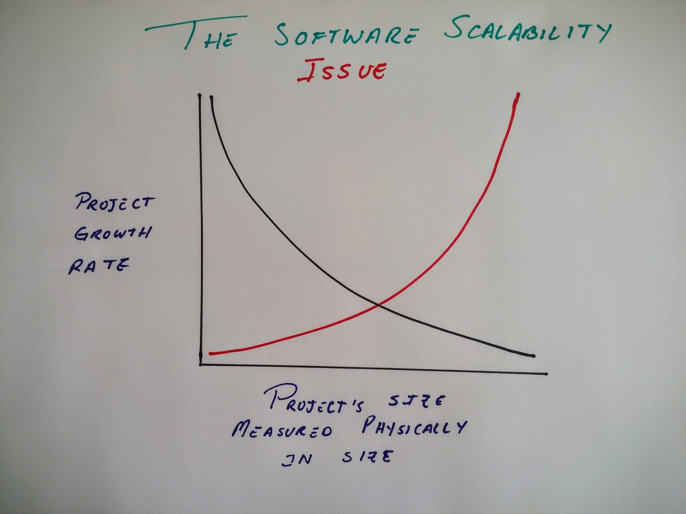

## Motivation

Through the years I've discovered that the biggest enemy of software is a misplaced sense of optimism in the wrong
direction. Software doesn't scale because people can handle quite a big set of information if they are using it on
their every day workflow. Furthermore people like working on humongous projects, call it the dictatorial syndrome or
the castle in the sky building syndrome or whatever, it does happen constantly and often. 

The problem already covered by Frederick Brooks in his book The Mythical Man Month looks something like this:



## History

LaTeX projects are no different, and they suffer from the same amount of size and complexity growth giving us a big 
pain when it comes to redesigning or making changes down the line. So when I set out nearly two years ago to build a 
system that would convert my LaTeX notes onto a beautiful document, a website with ads, and scale to an ebook, things 
eventually got out of hand.

## Scaling

This repository will contain basic information to build a system that compiles a Basic LaTeX document into three
deliverables. While everything related to the web styling wont be contained here, the information and research placed
in this document (for example the `build.sh` file) provides a valuable window on how to:
 
 - Assemble a LaTeX document into PDF, Ebook, Website (using `make4ht` and `tex4ebook`)
 - Provide hooks to add custom styling in html (using `make4ht` and `tex4ebook`)
 - Separating these styles in components 
 
## Components (**sty** files)

In LaTeX we have `packages` which contain some rules to style our documents, and thanks to @michal-h21 we have 
a way to add hooks to these `packages`. These `hooks` are used on **another** subset of `packages` to *structure* our
web pages. I say structure but we could also style the web pages using this, which we won't be doing, that is what
CSS is for. 

Thus we can convert safely from one environment `insert-ad` into an `html` snippet that contains an ad. These 
`packages` will change and keep scaling. This applies to the `packages` for print, web, and ebooks. 

## How are they used

In LaTeX you can do something like `\usepackage{pathToPackage/packageName}`, furthermore if the package is in the `PATH`
of LaTeX you can even do `\usepackage{packageName}`. LaTeX is so awesome that it can find packages with relative paths
to the folder in which you executed the `latex` command (for example `pdftex`, `xelatex`, `luatex`). 

TeX4HT is the main core that converts our LaTeX into HTML, and does not find packages that are in a relative path to
the directory in which we executed `tex4ht`. Thus we have to place them in a directory in which TeX4HT will be able to
find. This is easy to verify using a program called `kpsewhich fileStyle`. The `kpsewhich` command will then print out
the complete path to the file. Similar to `which` in `unix` and `where` in `windows`.

## Allowing our web styles to be found by TeX4HT

You'll find that all you need to do is to put your files in the `texmf` folder. A folder created by the LaTeX 
distribution in your local user home directory. This is where we use `symlinks`. We create a `symlink` in 
`~/texmf/tex/latex/` with the name of `ourStyles`. This is the following code in `build.sh`:

```
makeSymlink() {
    ABS_PATH=`cd "$1"; pwd`
    (cd ~/texmf/tex/latex/ && rm -f $1 && ln -s $ABS_PATH studyseries)
}
```

Using `symlinks` is a great way to keep your sanity, because it allows us to keep all the files we need locally in the
project structure instead of maintaining a second location. 

## The Symlink

The symlink allows for every style file to be used from the base folder of the symlink. Thus we can use the folder
as our main namespace and use the packages as follows:

`\usepackage{namespace/folder/folder/packageName}`

This allows for interesting expansion. 

We will break apart the styles between the following: 

    - *base* 
        - The styles for the PDF distribution
    - *ebook*
        - The structure and styles for the ebook
    - *web*
        - The structure and styles for the web version

## The Configuration Files

A configuration file is the main file to contain the `styles` for `make4ht` and `tex4ebook`. I named the configuration
file with a respective line ending for each toolchain:

    - `*.ebook.cfg` for `tex4ebook`
    - `*.make4ht.cfg` for `make4ht`
    
### The `make4ht` makefile

`make4ht` uses a `*.mk4` to specify all the rules to build the TeX file into HTML. 

## The Build file

The `build.sh` file contains the process to assemble the deliverables using the following notation:

```
Usage: ./build.sh [-f] file.tex [-c] webConfig.cfg [-e] epubConfig.cfg [-s] studyseries/
        The following options are available:

        -c [REQUIRED]
                Config file for Make4HT
        -f [REQUIRED]
                TeX main file
        -e [REQUIRED]
                Config file for TeX4Ebook
        -s [REQUIRED]
                Relative Path to Study Series Make4HT Styles
        -h
                Print this message
```

## The LaTeX source

All the LaTeX source for this demonstration will be contained in several files. The main entry point will be the
only LaTex file in the `root` folder. The rest of them will be broken down in the `src` folder. 

## Building the distribution

    `./build.sh -f helloworld.tex -c helloworld.make4ht.cfg -e helloworld.ebook.cfg  -s studyseries/`
    
# Separating the styles and the latex

We wont need to have the styles and the LaTeX source in the same folder, since all we need is a symlink, multiple
projects can be created as long as the symlink in `texmf` exists. 

