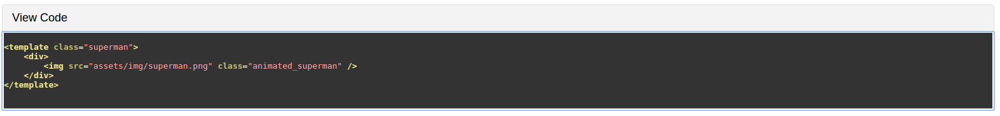

## TL;DR

The herein contained studyseries is a module to compile `tex` files into three different things:

 1. A pdf version
 2. An epub version
 3. A web version
 
Both web and epub versions use [Michal Hoftich's projects](https://github.com/michal-h21), 
[`tex4ebook` for epubs](https://github.com/michal-h21/tex4ebook), and [`make4ht` for web](https://github.com/michal-h21/make4ht).

## Requirements

The system uses the following:

 1. `xelatex` for pdf version
 2. `make4ht` for web version (and all its dependencies, such as `tex4ht`) 
 3. `tex4ebook` for ebook version (and all its dependencies)
    > Just install the whole latex thing
 4. Local Directory `studyseries` in here... which is symlinked to `texmf/tex/latex/`
 5. Local `studyseries.sh` in here... in `PATH` or symlinked to `usr/local/bin`
 6. A `make.mk4` file in the project to be built, which is the one in here and will be copied during the build.

## Styling

All styling is contained in the `studyseries` directory, and it contains the `sty` packages that  will be used
to compile to the three different document types and the base types. 

### Web Styling

Web styling is not done through `tex4ht`, the markup and the css are minimal to provide styling through `Polymer` components.

<h4><font color="red">The following is bad</font>:</h4>

```
<div id="chapter1">
    <div class="HelloSection"></div><a id="x1-20001"></a>
        Web Components
    <div class="somethingElse"></div><a id="chap:chapter01"></a>
    <p>   
        Web Components is a new set of standards that we can use to create complex UI
        widgets and application pieces. One platform for creating Web Components is
        Polymer, developed by Google.
    </p> 
    <p>  
        A Web Component contains elements that contain templates, styles, and logic,
        all encapsulated in that component. They have four specifications which
        are:
    </p> 
    <ul class="itemize1">
         <li class="itemize">Templates</li>
         <li class="itemize">Shadow Dom</li>
         <li class="itemize">Custom Elements</li>
         <li class="itemize">HTML Imports</li>
     </ul>
    <p>
        Templates are fragments of HTML for which the content is not loaded, until
        you get its content using Javascript without using AJAX, such content can be
        saved inside the <code class="prettyprint">&#x003C;template&#x003E;</code> and
        retrieved later.
    </p>
    
    <button class="heading" aria-controls="collapse1" onclick="Code.toggle('#collapse1')">View Code</button>   
    <iron-collapse id="collapse1" tabindex="0" opened="{{opened1}}"> 
        <div class="content"> <pre class="prettyprint"> 
         <pre class="listings"> <br /><span class="label"><a 
         id="x1-2001r1"></a></span>&#x003C;template class=&#x0022;superman&#x0022;&#x003E; <br /><span class="label"><a 
         id="x1-2002r2"></a></span>    &#x003C;div&#x003E; <br /><span class="label"><a 
         id="x1-2003r3"></a></span>        &#x003C;img src=&#x0022;assets/img/superman.png&#x0022; class=&#x0022;animated_superman&#x0022; /&#x003E; <br /><span class="label"><a 
         id="x1-2004r4"></a></span>    &#x003C;/div&#x003E; <br /><span class="label"><a 
         id="x1-2005r5"></a></span>&#x003C;/template&#x003E;
            <br /><span class="label"><a 
         id="x1-2006r6"></a></span></pre>
        </pre> </div> 
    </iron-collapse> 
    
    <a id="x1-2007r1"></a>
    <h3 class="sectionHead"><span class="titlemark">1.1</span> <a id="x1-30001"></a>First Section</h3>
    <p><a id="sec:firstSection"></a></p>
    <p>
        Example text
    </p>
    <ol class="enumerate1">
        <li class="enumerate" id="x1-3002x1">First&nbsp;item in a list</li>
        <li class="enumerate" id="x1-3004x2">Second&nbsp;item in a list</li>
        <li class="enumerate" id="x1-3006x3">Third&nbsp;item in a list</li>
        <li class="enumerate" id="x1-3008x4">Fourth&nbsp;item in a list</li>
        <li class="enumerate" id="x1-3010x5">Fifth&nbsp;item in a list</li>
    </ol>
    <a id="x1-3011r1"></a>
    <h4 class="subsectionHead">
        <span class="titlemark">1.1.1</span> <a id="x1-40001"></a>Furst SubSection
    </h4><p><a id="ssec:firstSubSection"></a></p>
    <p>
        Example text
    </p>
    </div>
  </div>
</div>
```

<h4><font color="green">The following is a bit better</font>:</h4>

```
<chapter>
    <title>
        <div class="HelloSection"></div><a id="x1-20001"></a>
            Web Components
        <div class="somethingElse"></div><a id="chap:chapter01"></a>
    </title>
    </content>
        <p>   
            Web Components is a new set of standards that we can use to create complex UI
            widgets and application pieces. One platform for creating Web Components is
            Polymer, developed by Google.
        </p> 
        <p>  
            A Web Component contains elements that contain templates, styles, and logic,
            all encapsulated in that component. They have four specifications which
            are:
        </p> 
        <ul class="itemize1">
             <li class="itemize">Templates</li>
             <li class="itemize">Shadow Dom</li>
             <li class="itemize">Custom Elements</li>
             <li class="itemize">HTML Imports</li>
         </ul>
        <p>
            Templates are fragments of HTML for which the content is not loaded, until
            you get its content using Javascript without using AJAX, such content can be
            saved inside the <code class="prettyprint">&#x003C;template&#x003E;</code> and
            retrieved later.
        </p>
    
        <study-series-code data-index="1">
            <pre class="prettyprint"> 
             <pre class="listings"> <br /><span class="label"><a 
             id="x1-2001r1"></a></span>&#x003C;template class=&#x0022;superman&#x0022;&#x003E; <br /><span class="label"><a 
             id="x1-2002r2"></a></span>    &#x003C;div&#x003E; <br /><span class="label"><a 
             id="x1-2003r3"></a></span>        &#x003C;img src=&#x0022;assets/img/superman.png&#x0022; class=&#x0022;animated_superman&#x0022; /&#x003E; <br /><span class="label"><a 
             id="x1-2004r4"></a></span>    &#x003C;/div&#x003E; <br /><span class="label"><a 
             id="x1-2005r5"></a></span>&#x003C;/template&#x003E;
                <br /><span class="label"><a 
             id="x1-2006r6"></a></span></pre>
            </pre> </div> 
        </study-series-code> 
        
        <section>
            <title>
                <a id="x1-2007r1"></a>
                <h3 class="sectionHead"><span class="titlemark">1.1</span> <a id="x1-30001"></a>First Section</h3>
                <p><a id="sec:firstSection"></a></p>
            </title>
            <content>
                <p>
                    Example text
                </p>
                <ol class="enumerate1">
                    <li class="enumerate" id="x1-3002x1">First&nbsp;item in a list</li>
                    <li class="enumerate" id="x1-3004x2">Second&nbsp;item in a list</li>
                    <li class="enumerate" id="x1-3006x3">Third&nbsp;item in a list</li>
                    <li class="enumerate" id="x1-3008x4">Fourth&nbsp;item in a list</li>
                    <li class="enumerate" id="x1-3010x5">Fifth&nbsp;item in a list</li>
                </ol>
                <subsection>
                    <title>
                        <a id="x1-3011r1"></a>
                        <h4 class="subsectionHead">
                            <span class="titlemark">1.1.1</span> <a id="x1-40001"></a>Furst SubSection
                        </h4><p><a id="ssec:firstSubSection"></a></p>
                    </title>
                    <content>
                        <p>
                            Example text
                        </p>
                    </content>
                </subsection>
            </content>
        </section>
    </content>
</chapter>
```

## But it's just more stuff!

It looks like it. Thing is, for most environments in `LaTeX` we have to provide `hooks` for Tex4HT, something [Michael helped document in helpers4ht](https://michal-h21.github.io/samples/helpers4ht/textstyle.html). 
It is not something straightforward and not something you may want to scale when messing with front end elements.

This is an extra level of hooks we are adding, so that we can pick up the hooks as HTML custom dom element components
 using something like Polymer (or RiotJS) os just plain Javascript. Then we can create and customize those components
 using entirely web development tools. 
 
Take for example the following code example:

```
<button class="heading" aria-controls="collapse1" onclick="Code.toggle('#collapse1')">View Code</button>   
<iron-collapse id="collapse1" tabindex="0" opened="{{opened1}}"> 
    <div class="content"> <pre class="prettyprint"> 
     <pre class="listings"> <br /><span class="label"><a 
     id="x1-2001r1"></a></span>&#x003C;template class=&#x0022;superman&#x0022;&#x003E; <br /><span class="label"><a 
     id="x1-2002r2"></a></span>    &#x003C;div&#x003E; <br /><span class="label"><a 
     id="x1-2003r3"></a></span>        &#x003C;img src=&#x0022;assets/img/superman.png&#x0022; class=&#x0022;animated_superman&#x0022; /&#x003E; <br /><span class="label"><a 
     id="x1-2004r4"></a></span>    &#x003C;/div&#x003E; <br /><span class="label"><a 
     id="x1-2005r5"></a></span>&#x003C;/template&#x003E;
        <br /><span class="label"><a 
     id="x1-2006r6"></a></span></pre>
    </pre> </div> 
</iron-collapse>
```

It looks like the following:



**And it works and looks amazing**, it is fantastic. Problem is if I wanted to look differently I have to change
the CSS and likely the markup of the iron-collapse component. While having a `<study-series-code>` may just very
well be implementing `iron-collapse` under the hood anyway. 


## Motivation

Through the years I've discovered that the biggest enemy of software is a misplaced sense of optimism in the wrong
direction. Software doesn't scale because people can handle quite a big set of information if they are using it on
their every day workflow. Add to this that people like working on humongous projects, call it the dictatorial syndrome or
the castle in the sky building syndrome or whatever, it does happen constantly and often. 

Which is why projects get out of hand very quickly, and refactoring is hard. 

The problem already covered by Frederick Brooks in his book The Mythical Man Month looks something like this:


## History

LaTeX projects are no different, and they suffer from the same amount of size and complexity growth giving us a big 
pain when it comes to redesigning or making changes down the line. So when I set out nearly two years ago to build a 
system that would convert my LaTeX notes onto a beautiful document, a website with ads, and scale to an ebook, things 
eventually got out of hand.

Just after a few chapters in your thesis and suddenly you are battling against a Chimera comprised of TiKZ, meta-post, 
tabularx, custom colors because oh dear laTeX doesn't come with Tornasol or litmus, long page configurations, a very 
special 50 line configuration for that *thing* you wanted at the bottom of the screen that displays the page number in 
a special font. 

Same goes for web, an audio player, sure, just add `<audio>` to your file. But now you want something else, you want
something with Tornasol or litmus color when the progress bar advances, well that will cost you a few hundred lines
of CSS... what? you want it cross browser and volume control on iOS? You will need the `WebAudio API` for that, which
is extra hundreds of lines of Javascript. 

## Scaling

While everything related to the web styling wont be contained here, the information and research placed
in this document (for example the `studyseries.sh` file) provides a valuable window on how to:
 
 - Assemble a LaTeX document into PDF, Ebook, Website (using `make4ht` and `tex4ebook`)
 - Provide hooks to add custom styling in html (using `make4ht` and `tex4ebook`)
 - Separating these styles in components 
 
## Components (**sty** files)

In LaTeX we have `packages` which contain some rules to style our documents, and thanks to @michal-h21 we have 
a way to add hooks to these `packages`. These `hooks` are used on **another** subset of `packages` to *structure* our
web pages. I say structure but we could also style the web pages using this, which we won't be doing, that is what
CSS is for. 

Thus we can convert safely from one environment `insert-ad` into an `html` snippet that contains an ad. These 
`packages` will change and keep scaling. This applies to the `packages` for print, web, and ebooks. 

## How are they used

In LaTeX you can do something like `\usepackage{pathToPackage/packageName}`, furthermore if the package is in the `PATH`
of LaTeX you can even do `\usepackage{packageName}`. LaTeX is so awesome that it can find packages with relative paths
to the folder in which you executed the `latex` command (for example `pdftex`, `xelatex`, `luatex`). 

TeX4HT is the main core that converts our LaTeX into HTML, and does not find packages that are in a relative path to
the directory in which we executed `tex4ht`. Thus we have to place them in a directory in which TeX4HT will be able to
find. This is easy to verify using a program called `kpsewhich fileStyle`. The `kpsewhich` command will then print out
the complete path to the file. Similar to `which` in `unix` and `where` in `windows`.

## Allowing our web styles to be found by TeX4HT

You'll find that all you need to do is to put your files in the `texmf` folder. A folder created by the LaTeX 
distribution in your local user home directory. This is where we use `symlinks`. We create a `symlink` in 
`~/texmf/tex/latex/` with the name of `ourStyles`. This is the following code in `build.sh`:

```
makeSymlink() {
    ABS_PATH=`cd "$1"; pwd`
    (cd ~/texmf/tex/latex/ && rm -f $1 && ln -s $ABS_PATH studyseries)
}
```

Using `symlinks` is a great way to keep your sanity, because it allows us to keep all the files we need locally in the
project structure instead of maintaining a second location. 

## The Symlink

The symlink allows for every style file to be used from the base folder of the symlink. Thus we can use the folder
as our main namespace and use the packages as follows:

`\usepackage{namespace/folder/folder/packageName}`

This allows for interesting expansion. 

We will break apart the styles between the following: 

  - *base* 
    - The styles for the all the distributions
  - *ebook*
    - The structure and styles for the ebook
  - *web*
    - The structure and styles for the web version
  - *pdf*
    - The structure and styles for PDF version

## The Configuration Files

A configuration file is the main file to contain the `styles` for `make4ht` and `tex4ebook`. I named the configuration
file with a respective line ending for each toolchain:

  - `ss.ebook.configuration` for `tex4ebook`
  - `ss.make4ht.configuration` for `make4ht`
    
### The `make4ht` makefile

`make4ht` uses a `*.mk4` to specify all the rules to build the TeX file into HTML. 

## The Build file

The `build.sh` file contains the process to assemble the deliverables using the following notation:

```
Usage: ./build.sh [-f] file.tex [-w] webConfig.cfg [-e] epubConfig.cfg [-s] studyseries/
        The following options are available:

        -c
                cleans the dist directory
        -w [REQUIRED]
                Config file for Make4HT
        -f [REQUIRED]
                TeX main file
        -e [REQUIRED]
                Config file for TeX4Ebook
        -s [REQUIRED]
                Relative Path to Study Series Make4HT Styles
        -h
                Print this message
```

## The LaTeX source

All the LaTeX source for this demonstration will be contained in several files. The main entry point will be the
only LaTex file in the `root` folder. The rest of them will be broken down in the `src` folder. For this example
we will use test files in the `latex-dummy-example` directory.

## Building the distribution

    ./build.sh -f filename.tex -w ss.make4ht.cfg -e ss.ebook.cfg  -s studyseries/
    

